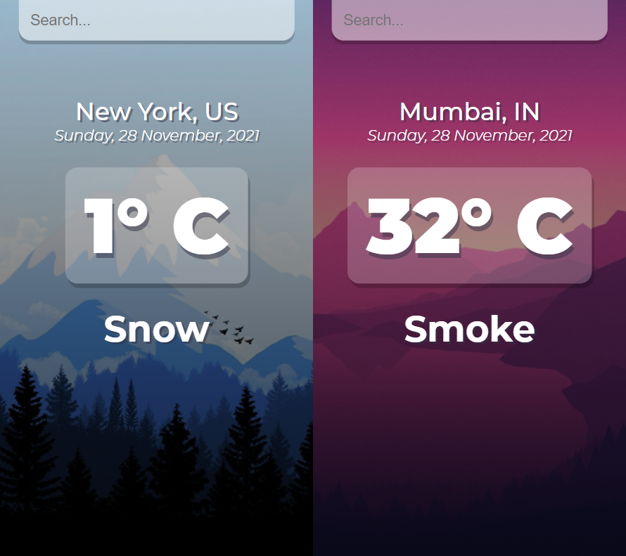

# **React Weather App**

A web app that shows you the current weather of your location and lets you search the weather of some other location as well.

**Technologies used**

-   HTML
-   CSS
-   JavaScript
-   React
-   OpenWeatherMap API

## **How to use**

1. Clone the repository.
2. Navigate to the folder.
3. Run `npm install` to install all the dependencies.
4. Run `npm start` to launch the app.

## **ToDos**

-   [x] Get weather of your current location.
-   [x] Search weather by a location name.
-   [ ] Change background according to the weather.
